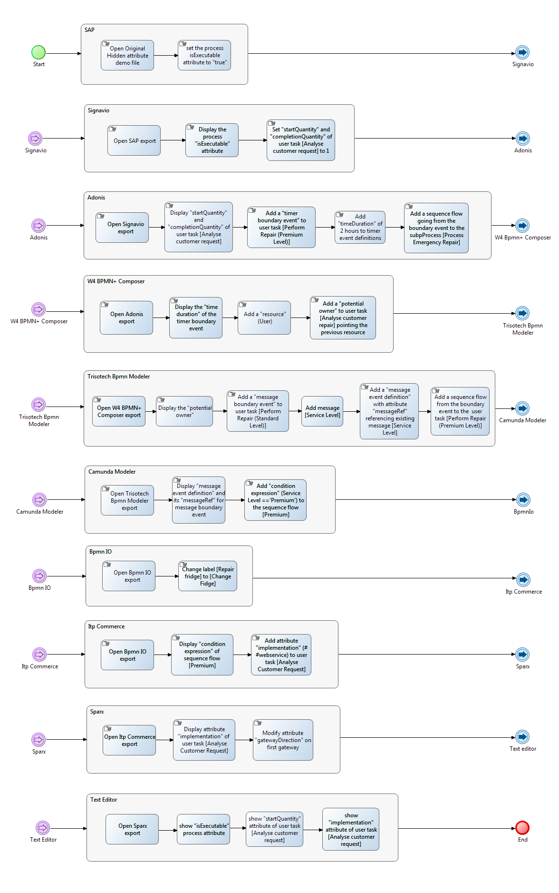
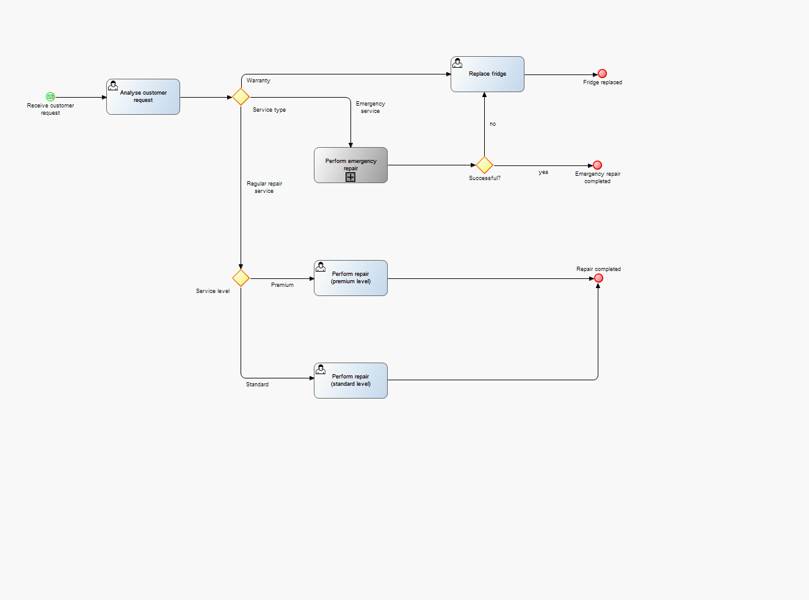
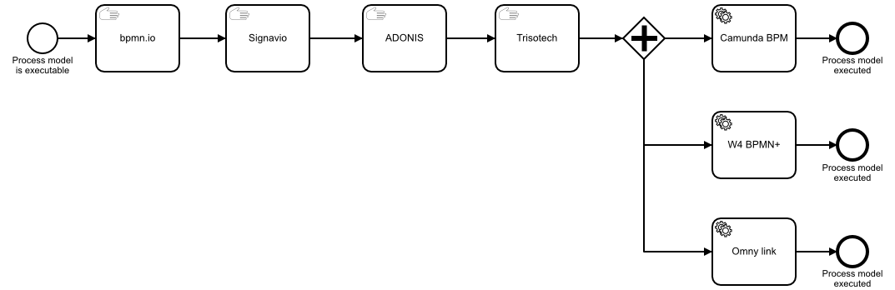
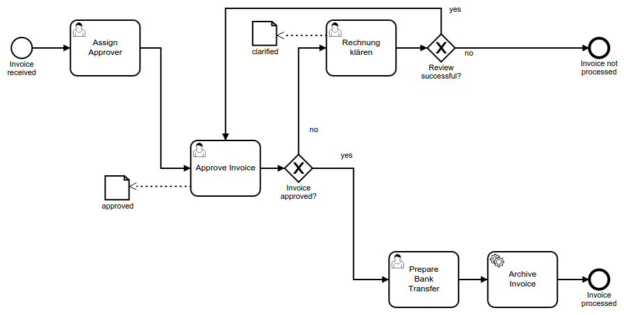
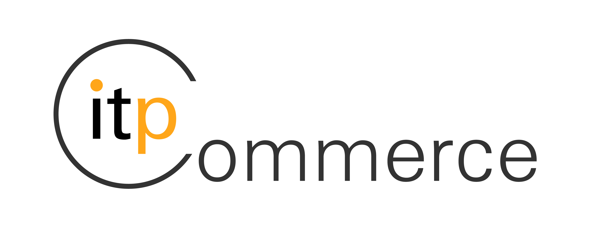
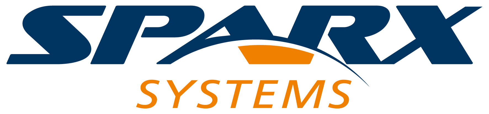

BPMN MIWG Demo at OMG Technical Meeting Berlin
==============================================

In June 2015 at the OMG Technical Meeting in Berlin, the BPMN Model Interchange Working Group is going to demonstrate the interchange of a BPMN process model between different tools of different BPM vendors.

This repository serves as a space for preparing the demo and publishing results afterwards.

There are three demo scenarios:

1. Diagram Interchange
----------------------

2. Hidden Attribute Interchange
-------------------------------
### Storyboard

### Example

3. Executable Model Interchange
-------------------------------

### Storyboard
Here is the demo storyboard for the interchange of an executable model:

### Example

Participating Vendors & Tools
-----------------------------
[Vendors interested in participating](http://doodle.com/gqhudvs2ys96hazr)

