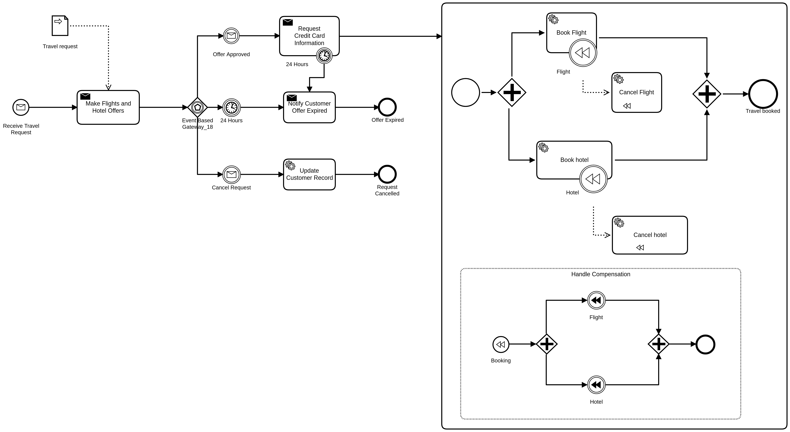

[Demo Model Breakdown](https://www.dropbox.com/s/grh78z2md5csz7c/Breakdown%20Travel%20Booking%20with%20Event%20Subprocess.pdf?dl=0)

## Cawemo

- Book Flight
- Flight
- Cancel Flight

## Camunda Modeler

1. Open `BeePMN - Sparx - ARIS - CaseAgile.bpmn`
2. Add an embedded sub-process called:
   - Make Booking
3. Add contents of `Cawemo-ADONIS (pl).bpmn`
4. Add contents of `Trisotech-ITESoft.bpmn`
5. Save as `part-1+2-Camunda.bpmn`

