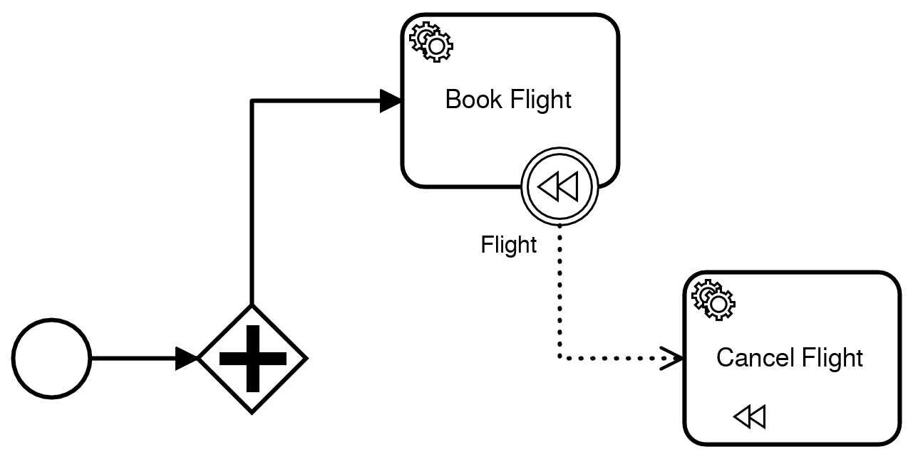
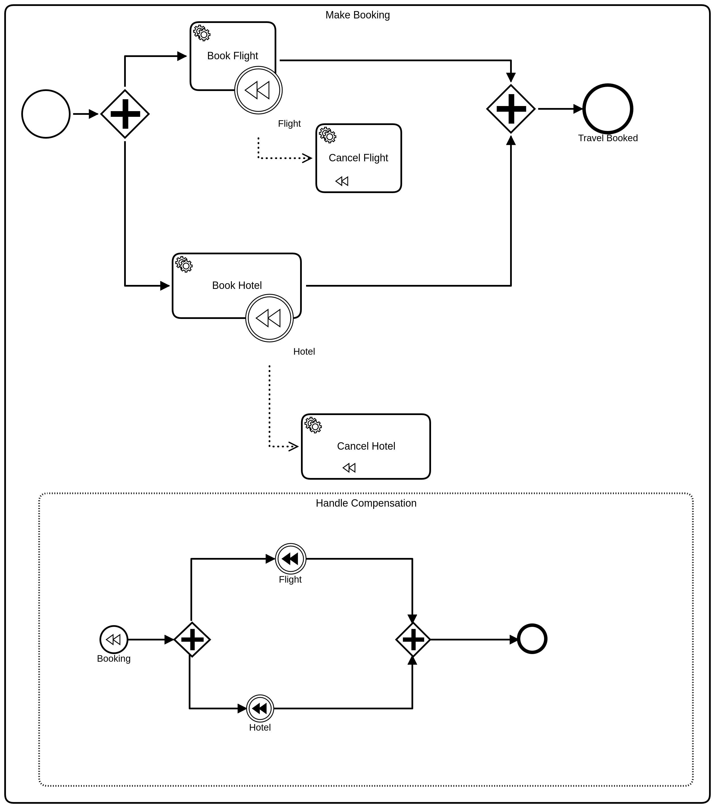

[Demo Model Breakdown](https://www.dropbox.com/s/grh78z2md5csz7c/Breakdown%20Travel%20Booking%20with%20Event%20Subprocess.pdf?dl=0)

## Cawemo

- Service Task: Book Flight
- Compensation Event: Flight
- Service Task: Cancel Flight
- save as `Cawemo.bpmn`

## Camunda Modeler

1. Create a new BPMN file

2. Add an embedded sub-process called:

   - Make Booking

3. Add contents of `Cawemo-ADONIS (pl).bpmn`

4. Add contents of `Trisotech-ITESoft.bpmn`

5. Save as `part2-Camunda.bpmn`

   

   

## Alternative Part for Camunda Modeler

1. Open `BeePMN - Sparx - ARIS - CaseAgile.bpmn`
2. Add an embedded sub-process called:
   - Make Booking
3. Add contents of `Cawemo-ADONIS (pl).bpmn`
4. Add contents of `Trisotech-ITESoft.bpmn`
5. Save as `part-1+2-Camunda.bpmn`

## On the fly checks

`find -iname '*.bpmn' -print0 | xargs -0 -L1 validbpmn`

